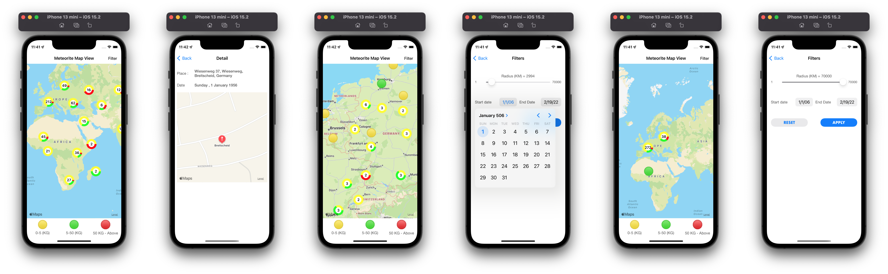

# Sbs Demo iOS App

## Objective

The goal is to create an application that can classify meteorite fall data based on the historical period, the mass of the object and the place of the event.

### Implementation
- App uses Rest API https://data.nasa.gov/resource/y77d-th95.json to fetch data and store locally in CoreData.
- The Meteorite landing are divided into 3 groups according to their mass distribution i.e small, medium and large, shown in different colors on Map.
- MKMapView is used to show the Meteorite landings, also with feature of clustering with the items count and color division with respect to the different items present in a cluster.
- Filter option is provided.
- User can apply filter based on the radius (with respect to its current location) and the Meteorite landings within that radius.
- User can also apply filters based on start date and end date (with respect to meteorite landings between that period)
- Upon clicking on any Map annotation, user will be redirected to a Detail screen.
- On Meteorite Detail screen, user can view the Reversed-GeoCoded address, the date of the fall and the Map of the place of the fall of the Meteorite.
- Reverse Geocoding has been applied efficiently with the use of caching (CoreData) to avoid repeated calls towards CLGeocoder.

## Screenshots

